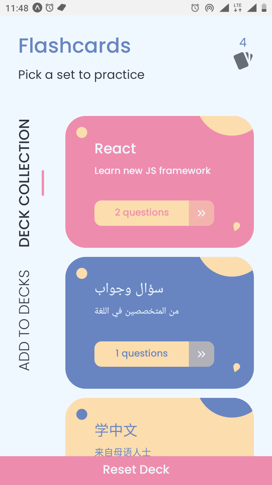
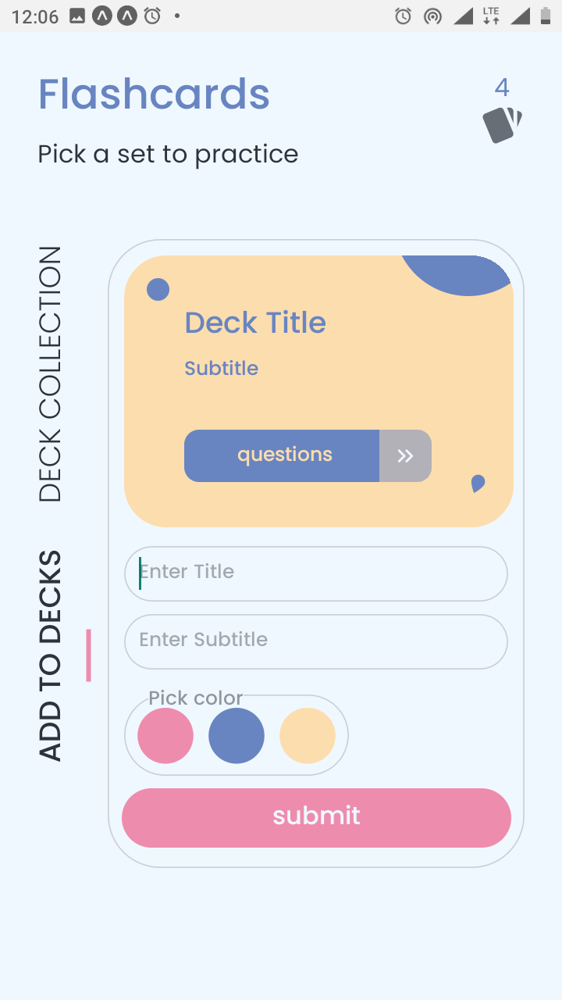
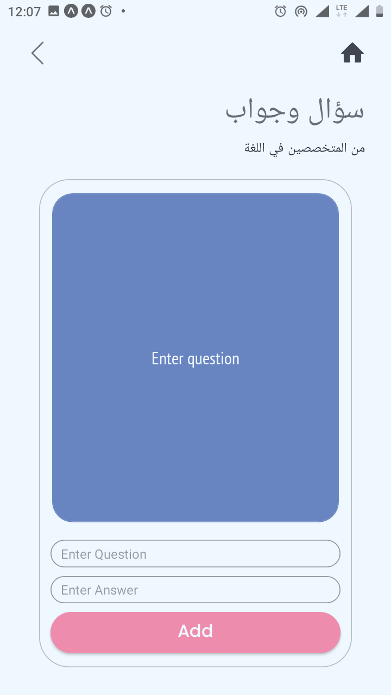
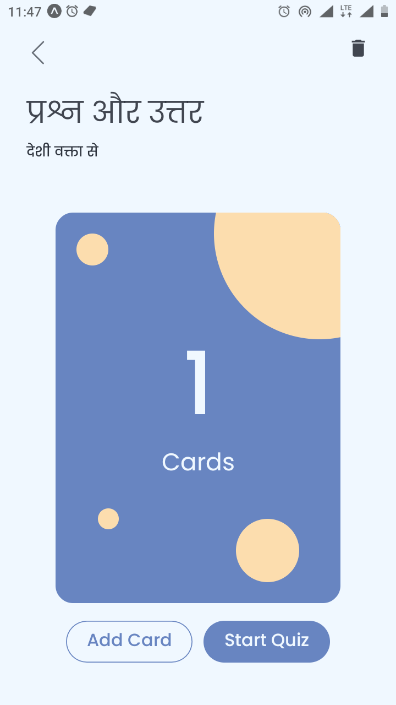
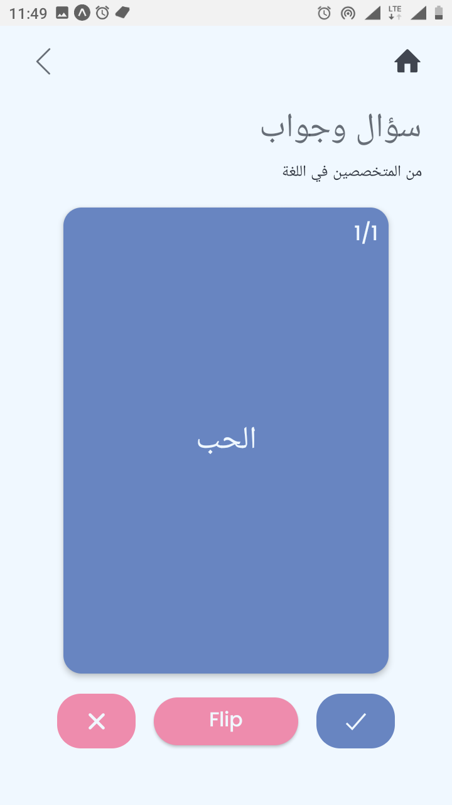
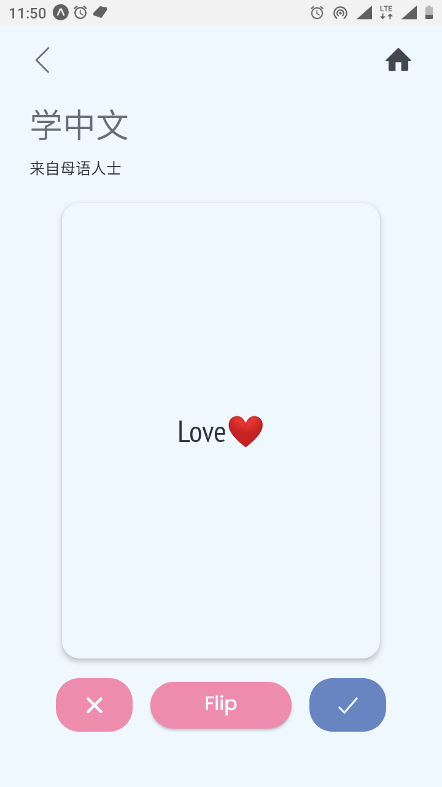
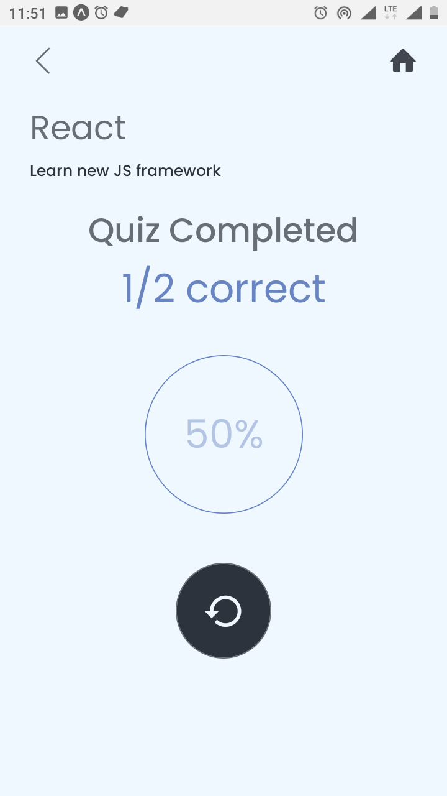

# Mobile Flashcards - Udacity React Native course final project

A Mobile App built with react-native for both Android and IOS device. this App allow users to create different categories of flashcards called "decks", add flashcards to those decks, then take quizzes on those decks.

## Preview

<span>
 
 
 
 
 
 
 
</span>

## Getting Started

1. Fork or Clone the repo, then set it up:

```javascript
$ cd mobile-flashcard
$ yarn
```

## Usage

The project can be run with npm or yarn

```javascript
$ yarn start
```

This will open Expo Developer Tools in the browser. You can then do one of the following.

Use your device to test:

Scan the QR Code using the Expo Client app (Expo Client for Android & iOS) from an Android or iOS device.

# Testing Platform

Android
